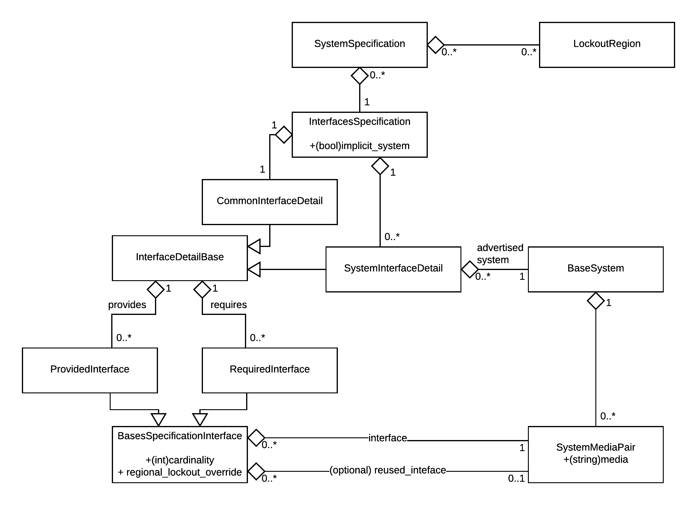

.. role:: app(emphasis)
.. role:: instance(emphasis)

=========
Developer
=========

******************************
applications as configurations
******************************

Each configuration (modeling different collections) is implemented as a separate application, that can then be
installed on the Django server as usual.

A difficulty with this desired behaviour is that even though some models will be the same for several applications,
and thus should be defined only once, each installed application should exclusively own all tables for all its models.
(i.e., there is sharing at the code level, but not at the database level).
It makes it impossible to install a simple common application defining the base models that would be used by all
specialized configurations installed, as the common applicatin tables would be shared by all configurations.

The chosen solution was to implement base models in *data_manager* application, but **not** installing it.
Instead, the configuration applications will import *data_manager* content **in their own namespace**, using
the `collecster_exec()` function.

***************
forms_admins.py
***************

EditLinkToInlineObject
======================

A class to be inherited by `AdminInline` instances to 'simulate' nested inlines.
The inheriting inline class then need to add ``"edit_link"`` to its collection of ``readonly_fields``.
When this configuration is done, a link to the nested model admin will be shown directly in the inline on edition.

The link text can be customized by defining the attribute ``link_text`` on the inline class.

SaveInitialDataModelForm
========================

Saves forms even when they only have initial values.

SaveEmptyDataModelForm
======================

Always saves the forms, even if it is empty with no initial data.

PropertyAwareModelForm
======================

Implements the :ref:`collecster_properties` feature.

PropertyAwareSaveInitialDataModelForm
=====================================

A classe simply inheriting from both PropertyAwareModelForm_ and SaveInitialDataModelForm_.

CustomSaveModelAdmin
====================

Saves the user on ``created_by`` field if the model derives from ``AbstractRecordOwnership``.
It also introduces ``post_model_save()`` hook, plus an attempt to call ``admin_post_save()`` on models defining it.

.. _CollecsterModelAdmin:

CollecsterModelAdmin
====================

A ``ModelAdmin`` specialization that is used as admin for ``Concept``, ``Release`` and ``Occurrence`` models.
It allows to implement most of the special features provided by Collecster over the native Django administration.

* :ref:`exclude field on addition <collecster_exclude_create>`
* :ref:`fields read-only on edition, read-and-write on addition <collecster_readonly_edit>`
* :ref:`dynamic list of inline classes <collector_dynamic_inline_classes>`
* :ref:`dynamic inline instances manipulation <collecster_instance_callback>`

.. _collecster_payload:

collecster_payload
==================

The ``collecster_payload`` is a custom dictionary that is attached as an attribute to Django ``Request`` instances.
data_manager/utils_payload.py provides helper functions to manipulate this object, creating it when required.

It is used for several related purposes:

Forward data from views to callbacks
------------------------------------

* Ajax views use it to transparently forward informations, through the (fixed signature) Admin methods,
  to the cutom callbacks ``collector_dynamic_inline_classes_`` or ``collecster_instance_callback_``,
  as they receive the :instance:`request` as argument. Examples:

  * ``concept_id``, ``release_id``  selected on the current form.
  * ``nature_set`` as the list of natures requested by GET.
  * ``inline_groups`` to retrieve (see below).

.. _collecster_payload_group:

Filter the returned inline classes
----------------------------------

* ``CollecsterModelAdmin::get_inline_instance()`` only return inlines for the groups listed under the key ``inlines_groups``
  if this key is found in the payload.

Forward the object even on addition
-----------------------------------

* Patches a native ``ModelAdmin`` behaviour: ``_create_formsets`` does not forward the currently created object when adding.
  We manually forward it in the payload, with the approriate key ``concept``, ``release``, or ``occurrence``.

*********
Specifics
*********

.. py:module:: advideogame.utils

The specific formsest are generated and displayed asynchronously, when the form fields allowing to generate the list
of specifics (the *trigger fields*) are updated by the user.

The client side logic is implemented in *Collecster/static/data_manager/scripts/form_ajax.js*.
It notably sets up change callbacks on the *trigger fields*. When the event is fired, it makes a call to a specific
url of the application.

On the backend, the requested view logic populates the request with a :ref:`collecster_payload` to forward custom data.
Notably, it sets the *inline_groups* which specifies which entries from the admin class
:instance:`collecster_refresh_inline_classes` will be rendered (in this case, the value is **specific**).
Then, calls to `get_admin_formsets` and `render_admin_formsets` generate the resulting HTML, which is sent as the
response.

In the case of a *specific*, the admin inline class is SpecificStackedInline:

.. autoclass:: SpecificStackedInline

****
Tags
****

A :ref:`tag <tag_glossary>` generation system is distributed with Collecster (as a subpart of *advideogame* for the moment).

The tags are generated as HTML pages. This choice was preferred over plain image (eg. generated with PIL) for a few reasons:

* It allows to leverage existing CSS layout systems for the tag's layout
* It is a more compact representation
* It makes comparison by difference much easier (and adding semantic is made possible)
* Rendering from a server web page is trivial with solutions like Phantom.js, without the need to "manually" download the image

Layout
======

The current layout is hardcoded to be printed on *DECAdry* labels reference **DLW1736** (45.7x21.2 mm):
The layout is based on a 510x210 base raster, which is super-sampled 4 times on each dimension to give 2040x840 pixels image
to be printed at 1200dpi.

It is horizontally split in 2:

* the left half is the human-readable content
* the right half is a QR-code

Vertically, the 210 pixels of human content are conceptually divided in 15 rows of 14 pixels.

* 1/2 row of margin top and bottom (1/4 row left margin)
* the "upper content":

  * (up to) 7 rows for release title
  * 1/2 row spacing
  * (at least) 2 rows for the platform info (regions, compatible systems, loose)

* 1 row spacing
* the "lower content":

  * 1.25 row tag details (tag version, collection name, object type)
  * 1/4 row spacing
  * 2 rows occurrence info (origin, working state, owner, occurrence tag-id)

There is a simple "space allocation priority" system in place.
In particular, the release title can consume as much as it needs from its allowed 7 rows.
Then, the platform info can potentially use the vertical space not consumed by the release title,
for its compatible systems' list.

QR code
-------

The right half of the tag is a version 1 QR code with 'M' level of correction.

The data layout is given below (the data is little endian):

======== ====================== ====================== ========= ==========================
Reserved collection indentifier object type identifier user GUID user occurrence-identifier
======== ====================== ====================== ========= ==========================
1 byte   2 bytes                1 byte                 4 bytes   4 bytes
======== ====================== ====================== ========= ==========================

For a rational use case of such information, see :ref:`tag_to_occurrence`.

The **object type identifier** is allowing to later assign tags to more than physical occurrences. (eg. boxes, shelves):

* 1: physical occurrence

***********
advideogame
***********

Platform
========

Models
------

.. autoclass:: SystemSpecification
   :members:

.. autoclass:: InterfacesSpecification

.. autoclass:: SystemInterfaceDetail

.. autoclass:: CommonInterfaceDetail

Both SystemInterfaceDetail and CommonInterfaceDetail inherit from InterfaceDetailBase:

.. autoclass:: InterfaceDetailBase

An interface is represented by a SystemMediaPair:

.. autoclass:: SystemMediaPair

Diagram
-------

Going further
-------------

This modelisation is a very rough abstraction over the reality of what constitutes compatibility between entities.
In case the model should be extended:

* a potential track is in mechanical, electrical and pin compatibility (https://en.wikipedia.org/wiki/Pin_compatibility)
* notion of protocol

If later implementing a compatibility algorithm:

* a "require" cannot use a "provided" on the same release (eg. Sonic & Knuckle top port)
